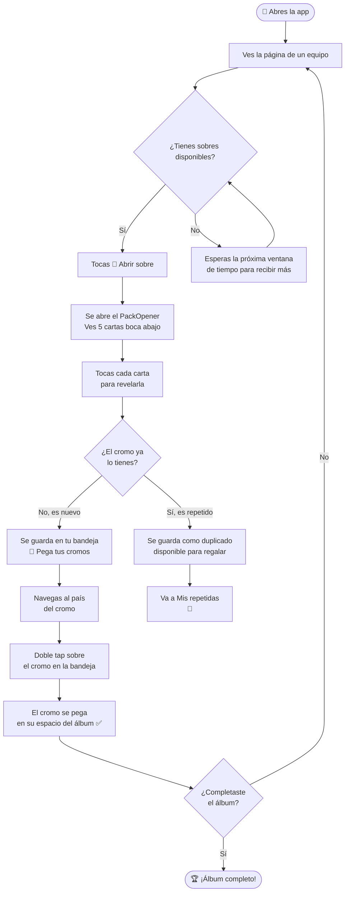
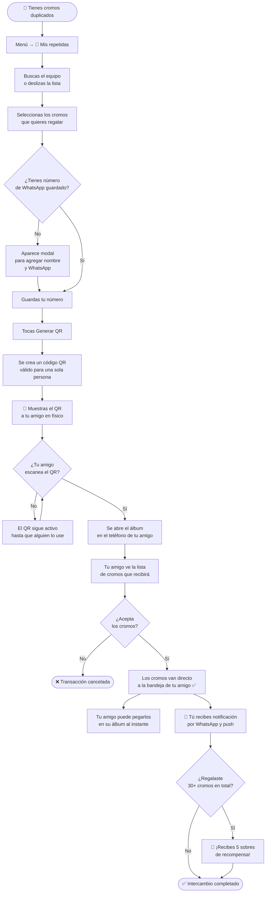
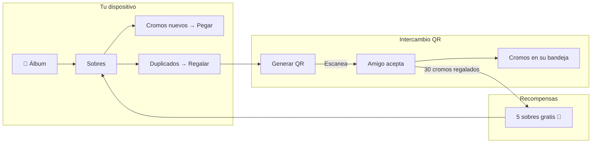

# Flujos de usuario — Álbum de Figuritas WC2026

---

## 1. Flujo para llenar el álbum

### Pasos clave

| Paso | Acción | Resultado |
|------|--------|-----------|
| 1 | Abrir sobre | 5 cromos aleatorios revelados |
| 2 | Revelar cromo | Se guarda en la bandeja si es nuevo |
| 3 | Ir al país | Navega a la página del equipo |
| 4 | Doble tap en cromo | Se pega en el álbum |
| 5 | Repetir | Hasta completar los 576 cromos |

> **Nota:** Los sobres se recargan automáticamente por ventanas de tiempo. Cuantos más cromos tengas, más raros se vuelven los nuevos.

---

## 2. Flujo para intercambiar / regalar cromos

### Pasos clave

| Paso | Quién | Acción |
|------|-------|--------|
| 1 | **Emisor** | Abre "Mis repetidas" y selecciona cromos |
| 2 | **Emisor** | Toca "Generar QR" |
| 3 | **Emisor** | Muestra el QR al receptor (en físico) |
| 4 | **Receptor** | Escanea el QR con la cámara |
| 5 | **Receptor** | Acepta los cromos en la app |
| 6 | **Receptor** | Pega los cromos en su álbum al instante |
| 7 | **Emisor** | Recibe notificación de confirmación |
| 8 | **Emisor** | Si acumula 30+ regalados → 5 sobres de recompensa |

> **Importante:** El QR es de un solo uso. Una vez que el receptor lo acepta, no puede usarse de nuevo.

---

## Resumen visual del ecosistema

